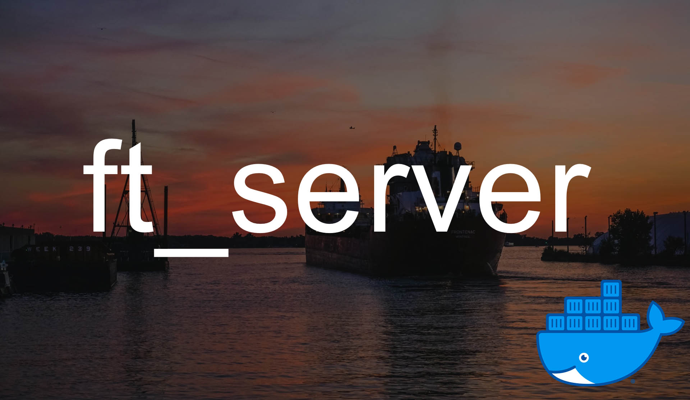

# ft_server



<span>Photo by <a href="https://unsplash.com/@briannjoness?utm_source=unsplash&amp;utm_medium=referral&amp;utm_content=creditCopyText">Brian Jones</a> on <a href="https://unsplash.com/s/photos/docks?utm_source=unsplash&amp;utm_medium=referral&amp;utm_content=creditCopyText">Unsplash</a></span>

  # Table of contents:
<details>
  <summary>Click to expand</summary>

1. [Description](https://github.com/kukinpower/ft_server#-description)
2. [Instructions](https://github.com/kukinpower/ft_server#-instructions)
	1. [Contents](https://github.com/kukinpower/ft_server#-contents)
	2. [Download and build](https://github.com/kukinpower/ft_server#-download-and-build)
	3. [Run a conteiner](https://github.com/kukinpower/ft_server#%EF%B8%8F-run-a-container)
	4. [Autoindex](https://github.com/kukinpower/ft_server#-autoindex)
3. [Research](https://github.com/kukinpower/ft_server#%EF%B8%8F-research)
	1. [Docker](https://github.com/kukinpower/ft_server#-docker)
		1. [Start here](https://github.com/kukinpower/ft_server#-start-here)
		2. [Virtual Machines vs Containers](https://github.com/kukinpower/ft_server#-virtual-machines-vs-containers)
	2. [Web-server](https://github.com/kukinpower/ft_server#web-server)
		1. [Server](https://github.com/kukinpower/ft_server#server)
		2. [Linux](https://github.com/kukinpower/ft_server#linux)
		3. [Nginx](https://github.com/kukinpower/ft_server#linux)
		4. [Mysql](https://github.com/kukinpower/ft_server#linux)
		5. [Makefile](https://github.com/kukinpower/ft_server#linux)
		6. [Wordpress](https://github.com/kukinpower/ft_server#linux)
		7. [SSL](https://github.com/kukinpower/ft_server#linux)
		8. [Phpmyadmin](https://github.com/kukinpower/ft_server#linux)
	3. [Useful links to understand containers deeper](https://github.com/kukinpower/ft_server#-useful-links-to-understand-containers-deeper)
</details>

# 👨🏻‍🏫 Description

`ft_server` is a school 21(42) project.

Project could be used to build a `LEMP-stack web-server` docker image.

Stack of technologies: `debian`, `nginx`, `mariadb`, `phpmyadmin`, `php`, `wordpress`

## 👉🏻 Instructions

### 📦 Contents

`Dockerfile` with all instructions to build a server image.

`srcs/` contains configs and some bash scripts.

`Makefile` to simplify running commands and save or logs while building to the file `build_logs` (will be created by running `make build`),

### 🔨 Download and build

```
git clone https://github.com/kukinpower/ft_server.git
cd ft_server
make build
```

Or you can simply pull the image:
```
docker pull docker.pkg.github.com/kukinpower/ft_server/ft_server:1.0
```

### 🏃🏼‍♀️ Run a container

`make run` to run a container

or `docker run -it -p 80:80 -p 443:443 ft_server:latest` if you pulled an image from github.

### 🗂 Autoindex

to turn autoindex off `bash ~/autoindex_off.sh`

to turn autoindex on `bash ~/autoindex_on.sh`

# 🕵🏽‍♀️ Research

## 🐳 Docker

### 👉🏻 [Start here](https://www.docker.com/101-tutorial)

Or start [Docker Curriculum](https://docker-curriculum.com/) by [Prakhar Srivastav](https://github.com/prakhar1989/)

[The Docker handbook](https://www.freecodecamp.org/news/the-docker-handbook/)

If your internet is slow or you are using mobile internet, use this platform to [play with docker](https://labs.play-with-docker.com/).

After every instruction a new layer is created.

`RUN` instruction to execute commands. In `shell form` it commits a new `layer` with execution result. The result will be used for a next step. I use `\` to split command to several lines.

If `WORKDIR` isn't specified, the `/` root directory will be used as work directory.

* [Default workdir](https://docs.docker.com/engine/reference/run/#workdir)
* [More](https://www.educative.io/edpresso/what-is-the-workdir-command-in-docker#:~:text=The%20WORKDIR%20command%20is%20used,container%20at%20any%20given%20time.&text=If%20the%20WORKDIR%20command%20is,performs%20mkdir%20and%20cd%20implicitly.) about `WORKDIR`

`COPY . .`

The first dot `.` is current folder in `host ilesystem`, where the `Dockerfile` is.
The second dot `.` is the folder in `docker container filesystem` which defined by `WORKDIR` command in dockerfile

### 📦 Virtual Machines vs Containers

|	VM	|	Container	|
| ------------- |-------------|
|Heavyweight|Lightweight|
|Full isolated from the host OS and other VM's|Lightweight isolated from host and other containers|
|Runs it's own OS|Shares OS with the host|
|VM can use different OS from the host|Can use OS with the same kernel as host|
|Startup in minutes|Much faster startup|

* [Containers vs VMs](https://docs.microsoft.com/en-us/virtualization/windowscontainers/about/containers-vs-vm)
* [▶️ Virtualization explained](https://www.youtube.com/watch?v=FZR0rG3HKIk)

## Web-server

### 🎩 Server

`server` is a role, that computer takes. Every computer could be a server.

Types of servers are types of services that servers provide.

* [▶️ What is a server? Servers vs Desktops Explained](https://www.youtube.com/watch?v=UjCDWCeHCzY)
* [▶️ What is a proxy server?](https://www.youtube.com/watch?v=5cPIukqXe5w)

#### [How To Install Linux, Nginx, MariaDB, PHP (LEMP stack) on Debian 10](https://www.digitalocean.com/community/tutorials/how-to-install-linux-nginx-mariadb-php-lemp-stack-on-debian-10)

LEMP stack means: Linux, Nginx, MySQL, PHP.

[var/www or var/www/html?](https://www.digitalocean.com/community/questions/what-is-the-correct-folder-to-put-my-website-files-var-www-or-var-www-html)

`www-data:www-data` the first one is user, the second is group. That is what `debian` server uses by default.

### Linux

[What is `apt-get`](https://itsfoss.com/apt-get-linux-guide/)

The `y` flag is for auto "Yes"

Difference between `apt` and `apt-get`:
* [one](https://itsfoss.com/apt-vs-apt-get-difference/)
* and [two](https://askubuntu.com/questions/445384/what-is-the-difference-between-apt-and-apt-get)


### Nginx

* [▶️ What is NGINX](https://www.youtube.com/watch?v=WHv_t_yK-QM)
* [Nginx conf](https://www.digitalocean.com/community/tutorials/how-to-set-up-nginx-server-blocks-virtual-hosts-on-ubuntu-16-04#step-two-create-sample-pages-for-each-site)

### Mysql

`FLUSH PRIVILEGES` reloads grant tables.

### Wordpress:
* [how to download](https://wordpress.org/support/article/how-to-install-wordpress/#detailed-instructions)
* [Wordpress permitions](https://www.smashingmagazine.com/2014/05/proper-wordpress-filesystem-permissions-ownerships/)

### 🔐SSL:
* [How To Create a Self-Signed SSL Certificate for Nginx on Debian 10](https://www.digitalocean.com/community/tutorials/how-to-create-a-self-signed-ssl-certificate-for-nginx-on-debian-10)
* [Creating self signed SSL](https://linuxize.com/post/creating-a-self-signed-ssl-certificate/)

### Phpbyadmin
* [Install phpMyAdmin with Nginx on Debian 10 Buster](https://kifarunix.com/install-phpmyadmin-with-nginx-on-debian-10-buster/)

### Makefile:
* [Coloring output info](https://en.wikipedia.org/wiki/ANSI_escape_code#Colors)
* [RGB Colors](https://www.rapidtables.com/web/color/RGB_Color.html)

## 🔗 Useful links to understand containers deeper
* [Demystifying Containers - Part I: Kernel Space](https://medium.com/@saschagrunert/demystifying-containers-part-i-kernel-space-2c53d6979504) by [Sascha Grunert](https://github.com/saschagrunert)
* [Demystifying Containers - Part II: Container Runtimes](https://medium.com/@saschagrunert/demystifying-containers-part-ii-container-runtimes-e363aa378f25)
* [Demystifying Containers - Part III: Container Images](https://medium.com/@saschagrunert/demystifying-containers-part-iii-container-images-244865de6fef)
* [Docker docs](https://docs.docker.com/)

Author [Roman Kukin](https://github.com/kukinpower/)